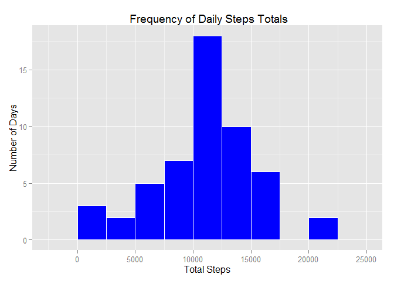
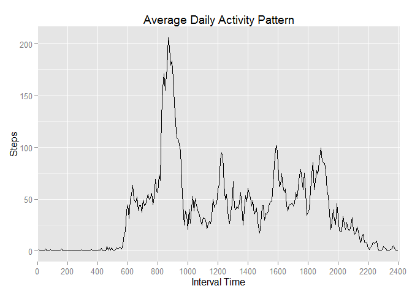
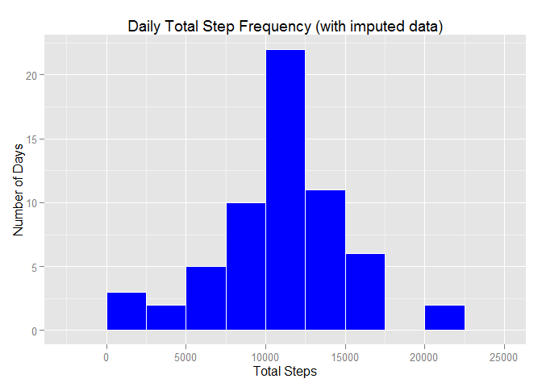
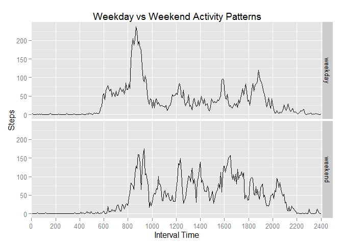

# Reproducible Research: Peer Assessment 1

## Loading and preprocessing the data
Define data source.

```r
zip <- "activity.zip"
filename <- "activity.csv"
```
The data file *activity.csv* is extracted from the archive file *activity.zip* and the data are loaded into a data frame.  

```r
unzip(zip,files = c(filename))
df <- read.csv(filename)
```
  
####Exclude incomplete records from data analysis####
Initial data tidying removes incomplete records. The *na.omit()* function eliminates all observations with missing values from the data frame. (Initial assessment shows that incomplete records are missing 'steps' values. So, any days/intervals with no steps recorded are eliminated in this phase of processing. Periods with '0' steps are not eliminated and will be included in analysis.)  

####Setting interval data as formatted character factor####
It has been noted that "interval" values in source data are encoded as enjambed hour and minute (i.e., 1745 indicates 5:45 PM), and are loaded by default as integer values. Treating this value as integer series for plotting introduces artificial gaps in the data (12 intervals with data at minutes 00 to 55 followed by 8  missing intervals for interval 60 through 95 in supposed integral series). Interval data values are therefore converted to factors and standardized as 4-character strings with leading 0s (for hours less than 10). Sequential numeric values for sorted factors supports properly calibrated time series plot (evenly spaced interval values on x-axis).

```r
# create working data set omitting rows with NA
dfc <- na.omit(df)
# prepend necessary 0's to interval and convert to factor
intvl_char <- function(intvl) {
  intvl <- as.character(intvl)
  require(stringr)
  intvl <- paste(str_dup("0", 4 - str_length(intvl)), intvl,sep = "")
  return(intvl)
}
dfc$interval <- factor(intvl_char(dfc$interval))
```

##What is mean total number of steps taken per day?##
Summarize steps data to get daily totals, then calculate mean and median.

```r
require(plyr)
daily_steps<-ddply(dfc,.(date),summarize,sum(steps))
colnames(daily_steps)<-list("Date","Steps")
#format numeric output for easier reading/comprehension
step_mean<-format(round(mean(daily_steps[["Steps"]])), scientific=FALSE,big.mark=",",big.interval=3)
step_median<-format(median(daily_steps[["Steps"]]), scientific=FALSE,big.mark=",",big.interval=3)
```
**The mean total steps taken per day is 10,766.**  
**The median total steps taken per day is 10,765.**  
  
The histogram below plots frequency of daily steps totals reported in 2500-step ranges. NOTE: Total days (sum of frequencies) is less than 61 days because days that had no record of steps have been excluded.

```r
require(ggplot2)
g<-ggplot(data=daily_steps, aes(Steps)) 
g<-g + geom_histogram(binwidth=2500, color="white", fill="blue")
g + labs(y="Number of Days", x="Total Steps", title=" Frequency of Daily Steps Totals")
```

 

## What is the average daily activity pattern? 
Steps are grouped by interval and summarized so that mean number of steps can be plotted for each 5-minute interval across the day. Higher mean steps count indicates increased 'activity' level for that time period. 
The interval showing the highest average number of steps is selected.

```r
interval_mean<-ddply(dfc,.(interval),summarize,mean=mean(steps))
colnames(interval_mean)<-list("Interval","Steps")

g<-ggplot(data=interval_mean,aes(as.numeric(Interval),Steps))
g<-g+scale_x_discrete(limits = c(0:288) ,breaks=seq(0,288,24), labels=seq(0000,2400,200)) 
g<-g+geom_line() 
g+labs(y="Steps",x="Interval Time",title="Average Daily Activity Pattern")
```

 

```r
maxstepinterval <- as.character( interval_mean[interval_mean$Steps == max(interval_mean$Steps), ]$Interval)
```
  
**The 5-minute time interval with the highest average step count across all days begins at *0835*.** NOTE: Interval is displayed as 'military time' with the first two digits showing hours (00-23) and the second two digits showing minutes (00-55) identifying interval.  

## Imputing missing values
Prior analysis required excluding records with missing steps data. Checking the count of excluded rows shows a significant number of records skipped.

```r
missingsteps <- nrow(df[!complete.cases(df),])
```
**There are *2304* rows missing steps data that were not included in preceding analysis.**

A new working dataset can be created from original data load to include records across all time intervals for all 61 days of the experiment. Any missing steps counts will be filled in with a value calculated as the mean of existing values for the corresponding interval and day of the week. (This presumes that the average for a given interval on a given day of the week is the best guesstimate for a missing interval.) No rows or records will be omitted due to missing data.

```r
# Add a column for day of the week so that we can calculate mean by time interval and day of week
dfc<-mutate(df,weekday=weekdays(strptime(df$date,"%Y-%m-%d")))
# create a data frame and lookup function to support updating NA with mean value for specified day of week and interval 
m_idow<-ddply(dfc,.(interval,weekday),summarize,steps=mean(steps,na.rm=TRUE))
lookup<-function(intvl,wday,stp){
  if (is.na(stp)){
    val<-round(m_idow[m_idow$interval==intvl & m_idow$weekday==wday,]$steps)
  } else { 
    val<-stp
  }
  return(val)
}
dfc<-ddply(dfc,.(date,interval,weekday),mutate,steps=lookup(interval,weekday,steps))
```
Prior analysis, which skipped days/intervals with missing data, is repeated here with artificially augmented dataset. Mean and median values are recalculated using the larger dataset.

```r
daily_steps<-ddply(dfc,.(date),summarize,sum(steps))
colnames(daily_steps)<-list("Date","Steps")

step_mean2<-format(round(mean(daily_steps[["Steps"]])), scientific=FALSE,big.mark=",",big.interval=3)
step_median2<-format(median(daily_steps[["Steps"]]), scientific=FALSE,big.mark=",",big.interval=3)
```
**The mean total steps taken per day is now calculated as *10,821*.** (Compared to *10,766* before NA values were filled in with imputed values.)

**The median total steps taken per day is now calculated as *11,015*.** (Compared to *10,765* before NA values were filled in with imputed values.)

**Adding imputed values has increased both the mean and median values for daily step totals.**

The histogram below plots frequency of new daily steps totals. Totals on some bars has increased reflecting the addition of days which had been previously excluded because they had no data. Total of all frequencies should now be 61.  


```r
g<-ggplot(data=daily_steps, aes(Steps)) 
g<-g + geom_histogram(binwidth=2500, color="white", fill="blue") 
g + labs(y="Number of Days", x="Total Steps", title="Daily Total Step Frequency (with imputed data)")
```

 

## Are there differences in activity patterns between weekdays and weekends?
Using the augmented data and day of week, we can plot activity patterns for weekday versus weekend. Again, the interval as factor provides the time series value on the x-axis.

```r
dfc$interval <-
  factor(paste(str_dup("0",4 - str_length(
  as.character(dfc$interval)
  )),as.character(dfc$interval),sep = ""))
  dfc <-
  ddply(dfc,.(steps,date,interval,weekday),mutate,weekpart = factor(ifelse(
  weekday %in% c("Saturday","Sunday"),"weekend","weekday"
  )))
  interval_mean <-
  ddply(dfc,.(interval,weekpart),summarize,mean = mean(steps))
  colnames(interval_mean) <- list("Interval","WeekPart","Steps")
  
  g<-ggplot(data = interval_mean,aes(as.numeric(Interval),Steps)) 
  g<-g + scale_x_discrete(
  limits = c(0:288) ,
  breaks = seq(0,288,24),
  labels = seq(0000,2400,200)) 
  g<-g + geom_line() + facet_grid(WeekPart ~ .)
  g + labs(y = "Steps",
         x = "Interval Time",
         title = "Weekday vs Weekend Activity Patterns")
```

 
